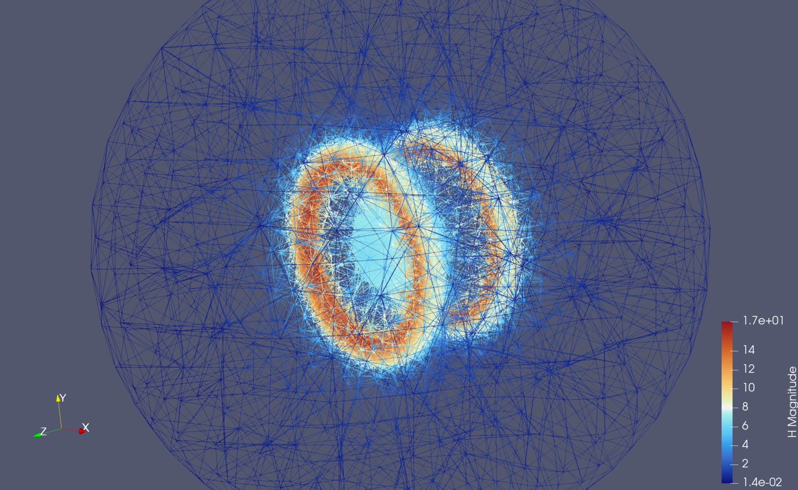
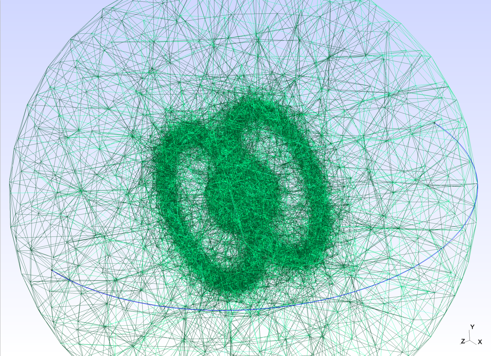
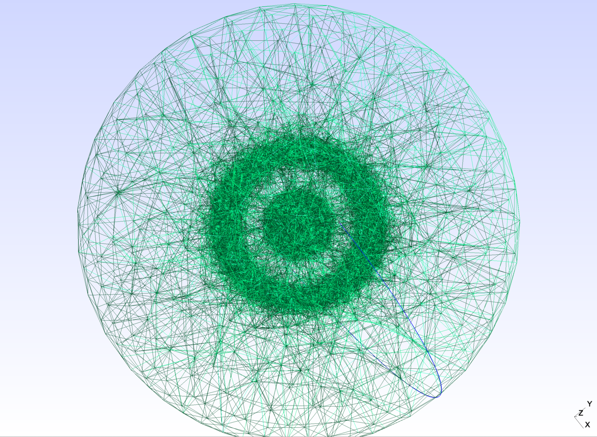

# Kuntur

Magnetostática por elementos finitos de una bobina de Helmholtz, como banco de campo uniforme para el ADCS de un CubeSat.

## Resultados



*Magnitud de H. El par concentra el campo entre las bobinas.*

 

*Malla del dominio de aire. Vista oblicua y vista axial, con refinamiento sobre las bobinas y en el centro del par.*

## Ejecución

```bash
julia --project=. -e 'using Pkg; Pkg.instantiate()'
julia --project=. main.jl
```

Los parámetros, la solución y el VTK están en `main.jl`. El planteamiento estacionario está en `src/stationary/helmholtz.jl`.

MIT · KYMA UN
